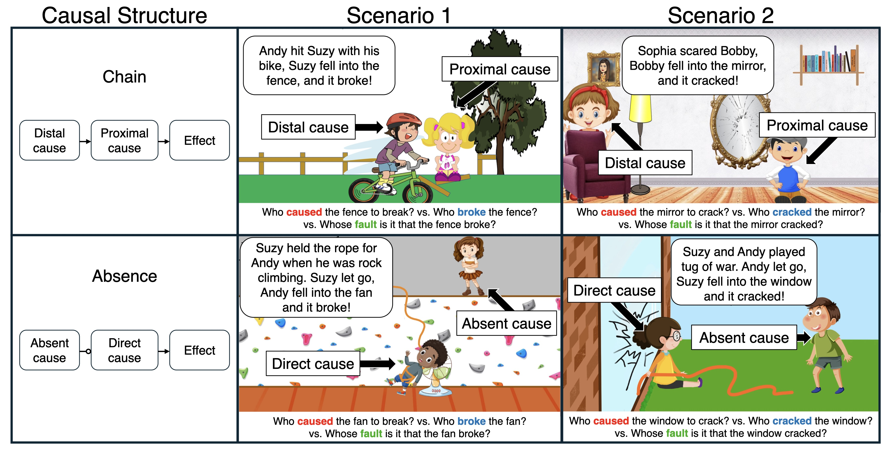

# Cause and Fault in Development

Welcome to the repository for the paper **"Cause and Fault in Development"**. This repository contains the experiments, data, analyses, and figures that support the research.

---

## 📖 Table of Contents
- [Introduction](#-introduction)
- [Repository Structure](#-repository-structure)
- [About the Experiments](#-about-the-experiments)

---

## 💡 Introduction

It’s widely thought that responsibility requires causation. This is codified in the law, and central to philosophical and psychological theories of causation and responsibility. But there are different kinds of causes. Some directly produce their effects, some do so indirectly and some, like absences, don’t produce them at all. Adults and children distinguish these kinds of causes and use different causal verbs to refer to them. Here we ask how children’s developing ability to distinguish these kinds of causes relates to their understanding of moral responsibility. We found in Experiment 1 that when Andy hits Suzy with his bike, she falls into a fence and it breaks, 3-year-old children understood “caused”, “break” and “fault” to refer to the proximal cause (e.g., Suzy). By 4, children understood these verbs to refer to different causes: Andy, the distal cause, “caused” the fence to break, it’s his “fault” that it broke, but Suzy, the proximal cause, “broke” it. In Experiment 2, we found that when Suzy let go of Andy’s safety rope, he slips while wall climbing, falls into a fan and the fan breaks, 3-year-olds understood “caused”, “break” and “fault” to refer to the direct cause Andy. Around 5 or 6, children understood these verbs to refer to different causes. Suzy, the absent cause, “caused” the fan to break, it’s her “fault” that it broke, but Andy, the direct cause, “broke” it. We discuss our findings in the context of an outcome to intention shift in children’s developing understanding of moral responsibility and suggest that there may be a more fundamental shift in children’s understanding of causation.



---

## 📂 Repository Structure

```plaintext
├── appendix
├── code
│   ├── R
│   ├── experiments
│   └── python
├── data
├── docs
└── figures
```

### 🔍 Detailed Breakdown
- **`appendix/`**: Contains additional information and analyses not included in the paper.
  - **`appendix.pdf`**: [The appendix document.](appendix/appendix.pdf)

- **`code/`**: All code for running experiments, analyzing data, and generating figures.
  - **`experiments/`**: Experiment-specific code, including pre-registrations available via the Open Science Framework:
    - **Experiment 1**  
      - Fault question first ordering ([pre-registration](https://osf.io/2u4fp/?view_only=405ad3e533ba4e85982c97b10c372257))  
      - Fault question last ordering ([pre-registration](https://osf.io/f4n6w/?view_only=c6898909be10454dad7075fd519a7afc))  
    - **Experiment 2** ([pre-registration](https://osf.io/sjakw/?view_only=1f1bc44ef0f24b869f6eef3a839440ad))
  - **`R/`**: Scripts for data analysis and figure generation. To see a rendered file, click "Website" above.

- **`data/`**: Contains anonymized datasets for all experiments.

- **`docs/`**: Contains a visualization of the analysis script in `code/R/`.

- **`figures/`**: All figures used in the paper, generated using scripts in `code/R/`.

---
<!-- 
## 🚀 Getting Started

1. Clone this repository:
   ```bash
   git clone https://github.com/your-username/cause-and-fault.git
   cd cause-and-fault
   ```
2. Install required dependencies for each language used in `code/`.

3. Navigate to `code/` for experiment execution or analysis scripts:
   - For data analysis:
     ```bash
     cd code/R
     Rscript analysis_script.R
     ```
   - For experiment execution:
     ```bash
     cd code/experiments
     python experiment1.py
     ```

--- -->

## 🔬 About the Experiments

- Experiments involving **children** were conducted using **Lookit**.  
- Pre-registrations for all experiments are accessible on the Open Science Framework (links provided in the [Repository Structure](#-repository-structure)).

---
<!-- 
## 🖼️ Figures

All figures in the paper can be found in the `figures/` directory, generated using the analysis scripts in `code/R/`.

--- -->

Feel free to suggest additional improvements or features via issues or pull requests!
