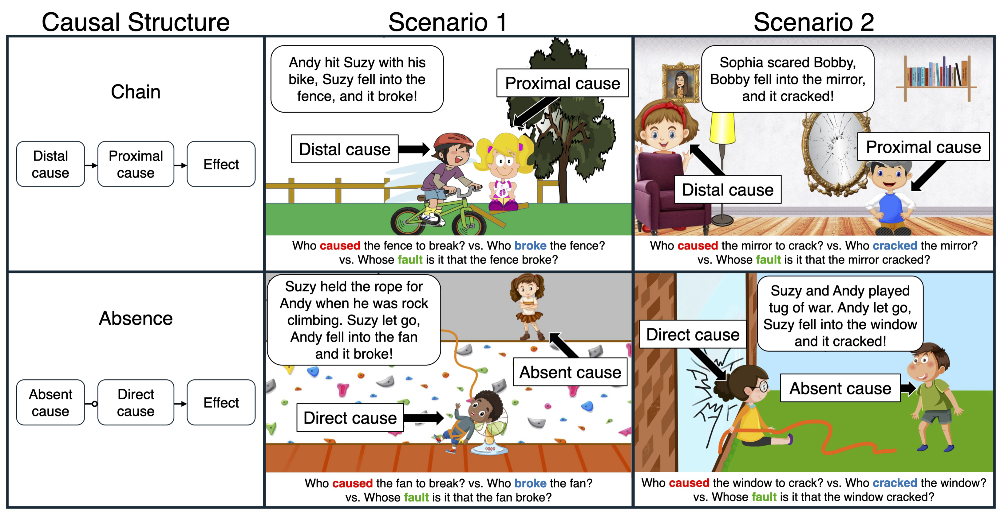

# Cause and Fault in Development

Welcome to the repository for the paper **"Cause and Fault in Development"**. This repository contains the experiments, data, analyses, and figures that support the research.

---

## 📖 Table of Contents
- [Introduction](#introduction)
- [Repository Structure](#repository-structure)

---



<br clear="left" />
<br clear="right" />

---

## 📂 Repository Structure

```plaintext
├── appendix
├── code
│   ├── R
│   ├── experiments
│   └── python
├── data
├── docs
└── figures
```

### 🔍 Detailed Breakdown
- **`appendix/`**: Contains additional information and analyses not included in the paper.
  - **`appendix.pdf`**: ([The appendix document.](appendix/appendix.pdf))

- **`code/`**: All code for running experiments, analyzing data, and generating figures.
  - **`experiments/`**: Experiment-specific code, including pre-registrations available via the Open Science Framework:
    - **Experiment 1**  
      - Fault question first ordering ([pre-registration](https://osf.io/2u4fp))  
      - Fault question last ordering ([pre-registration](https://osf.io/f4n6w))  
    - **Experiment 2** ([pre-registration](https://osf.io/sjakw))
  - **`R/`**: Scripts for data analysis and figure generation.  
    (View a rendered file [here](https://davdrose.github.io/cause_fault_dev/)).

- **`data/`**: Contains anonymized datasets for all experiments.

- **`docs/`**: Contains a visualization of the analysis script in `code/R/`.

- **`figures/`**: All figures used in the paper, generated using scripts in `code/R/`.

---
<!-- 
## 🚀 Getting Started

1. Clone this repository:
   ```bash
   git clone https://github.com/your-username/cause-and-fault.git
   cd cause-and-fault
   ```
2. Install required dependencies for each language used in `code/`.

3. Navigate to `code/` for experiment execution or analysis scripts:
   - For data analysis:
     ```bash
     cd code/R
     Rscript analysis_script.R
     ```
   - For experiment execution:
     ```bash
     cd code/experiments
     python experiment1.py
     ```

--- -->

## 🧪 About the Experiments

- Experiments involving **children** were conducted using **Lookit**.  
- Pre-registrations for all experiments are accessible on the Open Science Framework (links provided in the [Repository Structure](#repository-structure)).

---
<!-- 
## 🖼️ Figures

All figures in the paper can be found in the `figures/` directory, generated using the analysis scripts in `code/R/`.

--- -->

Feel free to suggest additional improvements or features via issues or pull requests!
